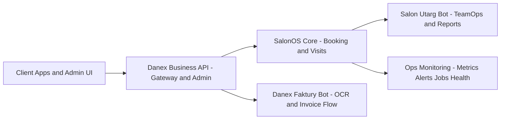

<div align="center">
  
</div>

<p align="center">
  I build production-style backend products: multi-tenant APIs, secure auth flows, operations monitoring, and automation bots.
</p>

<p align="center">
  <a href="https://github.com/danieloza/DANIELOZAHUB4"></a>
  <a href="https://github.com/danieloza/DANIELOZAHUB3"></a>
  <a href="https://github.com/danieloza/DANIELOZAHUB2"></a>
  <a href="https://github.com/danieloza/rag-api-starter"></a>
</p>

<p align="center">
  
  
  
  
  
</p>

## 15-Second Snapshot
- Python backend engineer focused on real product architecture, not toy demos.
- I ship gateway + core + bot ecosystems with tests, contracts, and operational scripts.
- My strongest stack: FastAPI, SQLAlchemy, Telegram bots, Docker, CI, and secure API design.

## Flagship Projects
| Project | What It Proves |
| --- | --- |
| [Danex Business API](https://github.com/danieloza/DANIELOZAHUB4) | Gateway/admin/public layer over SalonOS with JWT + cookie session + CSRF, CRM/invoices, ops metrics/alerts/jobs health, Alembic, Docker compose, CI/tests. |
| [SalonOS](https://github.com/danieloza/DANIELOZAHUB3) | Core multi-tenant booking and visit platform (FastAPI + Telegram bot), reservation status flow, conversion integrity, reports/exports, OpenAPI contract + quality gates. |
| [Danex Faktury Bot](https://github.com/danieloza/DANIELOZAHUB2) | Invoice automation bot with OCR pipeline, hash-based deduplication, review statuses, role-based access, retry/retention flows, and test suite. |
| [Salon Utarg Bot](https://github.com/danieloza/DANIELOZAHUB5) | TeamOps and reporting bot integrated with SalonOS workflows (leave, shift swaps, time clock, Google Sheets reporting). |
| [RAG API Starter](https://github.com/danieloza/rag-api-starter) | FastAPI mini-project for GenAI interviews with `/ingest`, `/ask`, `/health`, local FAISS indexing, and demo-ready setup in 2 minutes. |

## Demo In 2 Minutes
```powershell
git clone https://github.com/danieloza/DANIELOZAHUB4.git
cd DANIELOZAHUB4
powershell -ExecutionPolicy Bypass -File .\scripts\start_demo_stack.ps1 -SeedDanex -SeedDemoData
```

Open after startup:
- `http://127.0.0.1:8001/health`
- `http://127.0.0.1:8001/docs`
- `http://127.0.0.1:8000/docs`

## System Architecture


## Engineering Signals
- Auth patterns: JWT + secure cookie session + CSRF protection.
- Multi-tenant architecture and tenant-aware routing.
- Contract-first delivery with OpenAPI and CI quality gates.
- Production workflows: migrations, backup/restore drills, smoke and E2E scripts.
- Observability endpoints and operational runbooks.

## GitHub Stats
<p align="center">
  
  
</p>

## Target Roles
- Python Backend Engineer
- FastAPI/API Platform Engineer
- GenAI Automation and RAG Integrations
